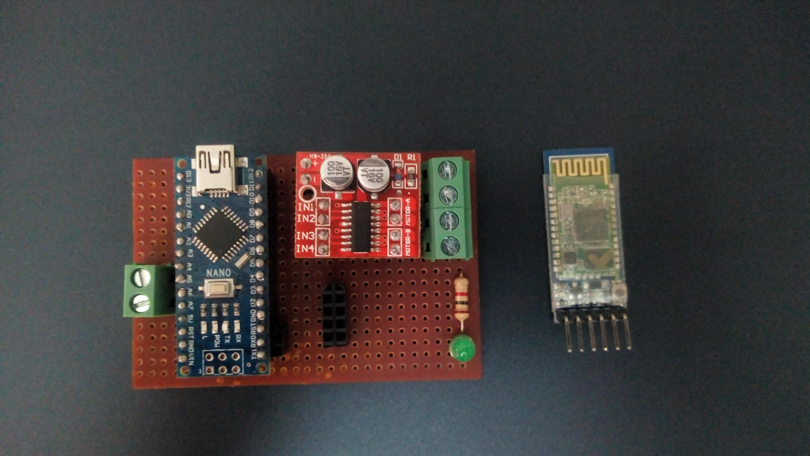
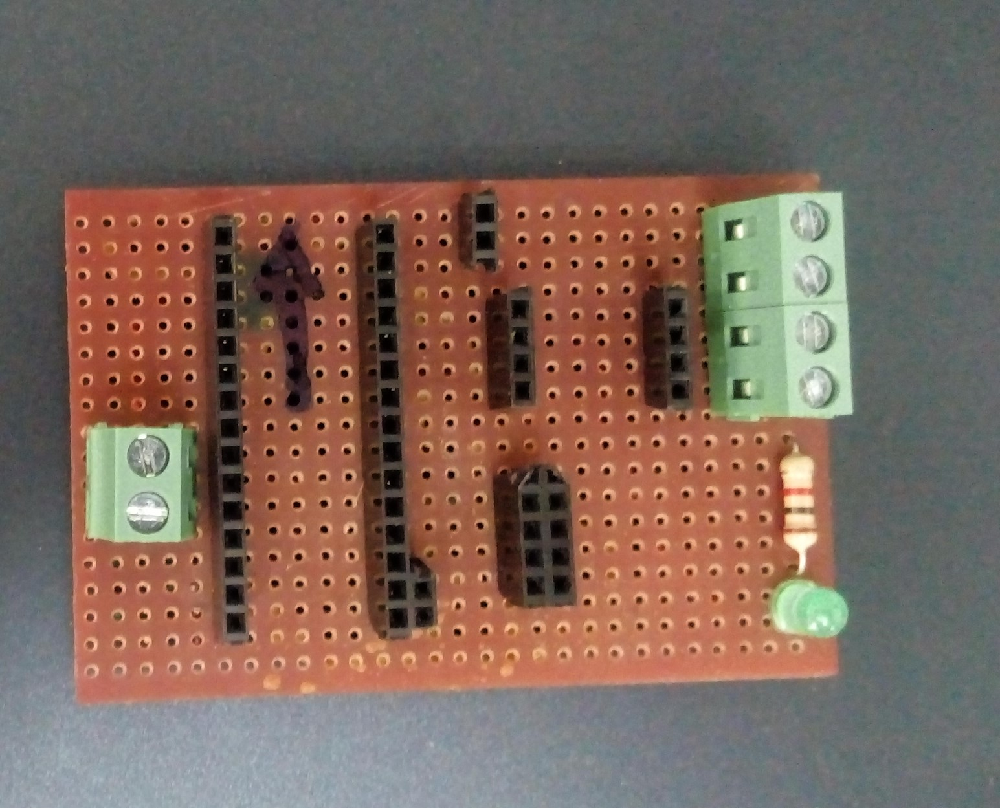
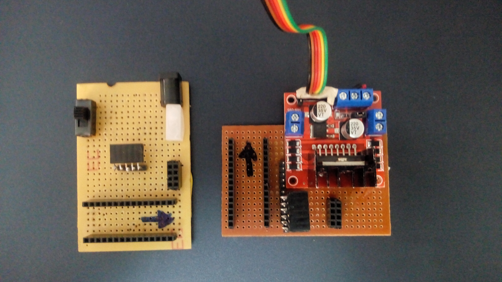
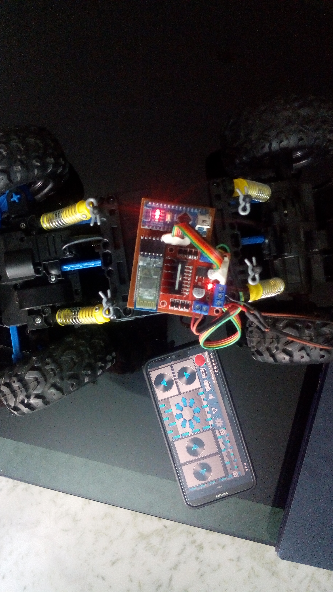

# HC-05BT-RC_Crawler

# NRF24-RC-Crawler

#Description: Remote allows player to control motion of toy car. My modules are of 2 types, one with the speed control and another on without using HC-05 Bluetooth module..
for RC cars, traxxas typos, Crawles, jeeps, and all steering typo RC cars.

Components:

    arduino nano for RX
    android mobile for TX
    some wires
    L298N (DualH-bridge //2A) for speedcontrol
    mx1508 (DualH-bridge//1.5A) without speedcontrol
    pcb boards 
    some batteries
    leds for indicator if required.
    resisotors for leds if.
    
 
 #TX and RX pcb board for without speed control module
 
 

```
connections to rx nano (crawler)
 
 battery + > vin  
 battery - > gnd
 
 BT HC-05
 VIN  > +5v of nano
 GND  > GND
 TX   > RX
 RX   > TX th pin of nano
 
 mx1508
 IN1    >  3
 IN2    >  4
 IN3    >  5
 IN4    >  6th pis of arduino nano 
 
```
 _as shown below
   
 

 
 #TX and RX pcb board for with speed control module
   
 
```
connections to rx nano (crawler)
 
 battery + > vin  
 battery - > gnd
 
 BT HC-05
 VIN  > +5v of nano
 GND  > GND
 TX   > RX
 RX   > TX th pin of nano
 
 
 L298N or L293D
 ENA    >  5
 IN1    >  3
 IN2    >  4
 IN3    >  7
 IN4    >  8
 ENB    >  6th pis of arduino nano
```
 
 
 _as shown bwlow
   
 
 demo
   
  
